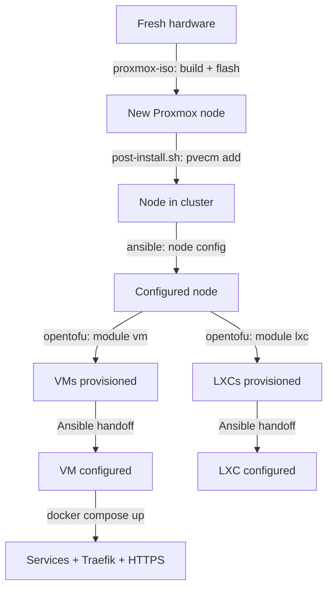

# proxmox-setup

Three components that together take a Proxmox homelab from "I have
hardware" to "everything is running, cluster is formed, VMs and
containers provision themselves":

| Component | What it does |
|---|---|
| [`proxmox-iso/`](proxmox-iso/) | Builds a **headless Proxmox installer ISO**. Flash, boot, walk away — the new node installs itself and joins your existing cluster automatically. |
| [`ansible/`](ansible/) | Ansible playbook that configures a Proxmox node from "fresh install" to "running the way I like it" — hostname, repos, users, SSH hardening, shared storage, Let's Encrypt certs, node_exporter. |
| [`opentofu/`](opentofu/) | OpenTofu modules + examples for **provisioning VMs and LXCs** on the cluster, with a clean handoff to Ansible for per-host configuration. Includes a Traefik + Cloudflare DNS-01 compose example. |

The three components are designed to work together but each is useful on
its own — you can use just the Ansible playbook against an existing
cluster, or just the OpenTofu modules against any Proxmox endpoint.

## Typical flow

1. Use `proxmox-iso/` to build a headless installer ISO for each node.
2. Flash + boot. Each node installs Proxmox and joins the cluster on
   its own.
3. Run `ansible/playbook.yml` to configure the nodes (users, repos,
   shared storage, optional Let's Encrypt cert on the web UI).
4. Use `opentofu/` to provision VMs and LXCs. Each VM/LXC is then
   handed off to Ansible automatically for configuration.
5. On the Docker VMs, deploy services behind Traefik (see
   [`opentofu/traefik-example/`](opentofu/traefik-example/) for the
   canonical pattern with Let's Encrypt via Cloudflare DNS-01).

## Cross-component dependencies

- `proxmox-iso/build-iso.sh` reads **`ansible/inventory.yml`** to
  auto-discover existing cluster nodes. Optionally reads a TSIG key from
  `ansible/vault.pwd` for first-boot DNS registration.
- `opentofu/` invokes **`ansible/playbook.yml`** via its own
  provisioner scripts, editing `ansible/inventory.yml` on the fly for
  fresh hosts.
- `ansible/` is the shared source of truth for "which hosts exist and
  how to reach them."

## What's intentionally not here

- **Cluster bootstrap** (first node). Create the cluster by hand on your
  first Proxmox node with `pvecm create`. Adding subsequent nodes is what
  `proxmox-iso/` handles.
- **Backups.** Configure Proxmox Backup Server or vzdump directly — too
  environment-specific to prescribe.
- **Prometheus / Grafana.** The Ansible playbook installs `node_exporter`
  on each Proxmox host; you bring your own Prometheus to scrape it.
- **A full app catalog.** The Traefik example is deliberately minimal
  (whoami). Everything beyond that is your own compose stacks.

## License

MIT — see [LICENSE](LICENSE).
