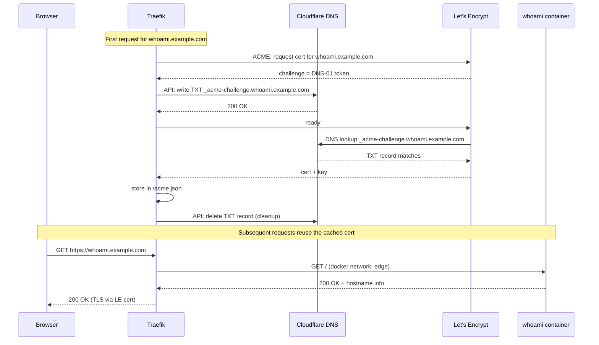

# traefik — Traefik + whoami + Cloudflare DNS-01

A minimal Docker Compose stack that demonstrates the HTTPS pattern the rest
of the example assumes: Traefik as the edge proxy, Let's Encrypt certs
issued via **Cloudflare DNS-01** (no inbound :80 needed), and a `whoami`
backend to prove end-to-end routing.

## How this gets deployed

This directory follows the `ansible/hosts/{hostname}/{service}/` convention
that `playbooks/deploy.yml` picks up automatically:

```text
ansible/hosts/docker-vm1/
└── traefik/
    ├── docker-compose.yml    — the stack
    ├── .env.j2               — rendered to .env on the host (Cloudflare token)
    ├── tasks.yml             — pre-deploy hook (creates acme.json with 0600)
    └── README.md             — this file (not copied to host)
```

Deploy with:

```bash
ansible-playbook playbooks/deploy.yml --limit docker-vm1 --tags traefik
```

The deploy task rsyncs the compose file + runs `tasks.yml` + renders `.env.j2`
+ does `docker compose up -d --pull always`. Re-run anytime to reconcile.

## Why DNS-01 (and not HTTP-01)?

- You don't need to expose port 80 to the internet. Great for LAN-only
  services you still want certs for.
- Works for wildcard certs, so you can issue `*.example.com` once and reuse.
- Needs an API token scoped to `Zone:DNS:Edit` on the target zone.



## Prerequisites

- A Cloudflare-managed zone for the domain you'll use (replace `example.com`
  throughout `docker-compose.yml`).
- A Cloudflare API token with **Zone:DNS:Edit** on that zone. Create it at
  <https://dash.cloudflare.com/profile/api-tokens>, then put it in your
  ansible vault as `vault_cloudflare_dns_token` — `.env.j2` reads from there.
- Docker + Docker Compose on the target host. `playbooks/docker.yml` installs
  both if the host is a member of `docker_hosts`.

## Adding more services

Any container on the `edge` network with the right labels gets routed:

```yaml
services:
  grafana:
    image: grafana/grafana
    networks: [edge]
    labels:
      - traefik.enable=true
      - traefik.http.routers.grafana.rule=Host(`grafana.example.com`)
      - traefik.http.routers.grafana.entrypoints=websecure
      - traefik.http.routers.grafana.tls.certresolver=cloudflare
      - traefik.http.services.grafana.loadbalancer.server.port=3000
```

To deploy Grafana as its own service, create
`ansible/hosts/docker-vm1/grafana/docker-compose.yml` + (optional) `.env.j2`
and run `ansible-playbook playbooks/deploy.yml --limit docker-vm1 --tags grafana`.

## Things deliberately left out

- **HTTP basic-auth password** for the dashboard is a placeholder. Generate
  a real one with `htpasswd -nB admin` and put it in the dashboard label
  (remember to double-up `$` to `$$` so Compose doesn't interpolate).
- **No automatic container restarts** on Traefik config changes — running
  `playbooks/deploy.yml` reconciles compose state via `docker compose up -d`.
- **No middleware chains** (rate limits, IP allow-lists, forward auth).
  Keep the example readable; add those per your environment.
