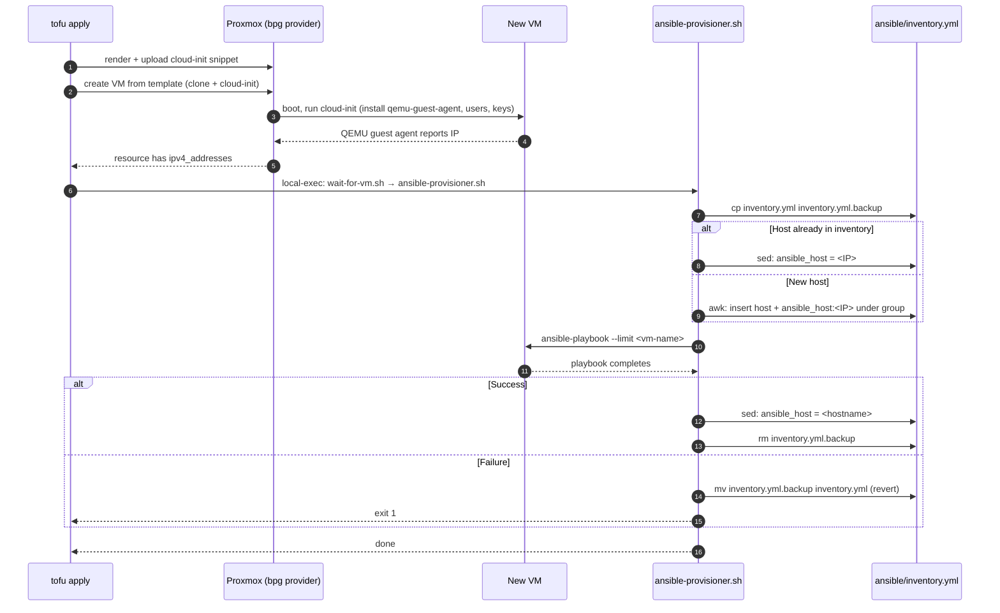
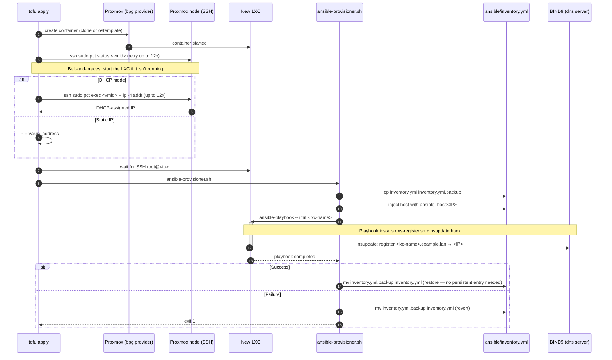

# opentofu — VM + LXC provisioning with Ansible handoff

OpenTofu configuration that provisions VMs and LXC containers on the
Proxmox cluster from `../ansible/`, then hands them off to Ansible for
configuration. The interesting part isn't the bpg/proxmox resources —
it's how the handoff from Terraform to Ansible is wired, including
automatic inventory edits so you don't have to manage two sources of
truth by hand.

```
opentofu/
├── README.md                              # this file
├── versions.tf, providers.tf              # provider pinning + config
├── variables.tf                           # top-level inputs
├── terraform.tfvars.example
├── main.tf                                # shared data (ssh key)
├── vm-example.tf                          # example: Docker VM
├── lxc-example.tf                         # example: Plex LXC
├── ssh-keys/                              # drop admin.pub here
├── templates/
│   └── cloud-init-default.yaml.tftpl      # injected by the VM module
└── modules/
    ├── vm/                                # reusable VM module
    └── lxc/                               # reusable LXC module
```

## Quick start

```bash
cd opentofu

# 1. Drop your SSH public key
cp ~/.ssh/id_ed25519.pub ssh-keys/admin.pub

# 2. Fill in the provider + per-node values
cp terraform.tfvars.example terraform.tfvars
$EDITOR terraform.tfvars

# 3. Review the examples — adjust node names, sizing, domain as needed
$EDITOR vm-example.tf lxc-example.tf

tofu init
tofu plan        # sanity check
tofu apply       # creates VM + LXC, runs Ansible against each
```

After `tofu apply` returns cleanly, the VM and LXC exist in Proxmox AND
their configuration has been applied by Ansible. Your sibling
`../ansible/inventory.yml` will have the VM's entry pointing to its
hostname; the LXC entry will be gone (LXCs self-register DNS, so no
persistent inventory entry is required — see the flow below).

## VM lifecycle — the Ansible handoff in detail



Key points:

- **Inventory is edited twice.** Once to inject the IP (so Ansible can
  connect before DNS is set up on the box), once to flip to the hostname
  after the playbook is done (so the persistent entry stays human-friendly
  and survives DHCP reassignments).
- **Backup + restore on failure.** If Ansible blows up, you don't get left
  with a half-modified inventory.
- **The bpg provider blocks on the guest agent.** `wait-for-vm.sh` only
  has to wait for SSH + cloud-init to finish, not for the IP itself.

## LXC lifecycle — slightly different



Differences from the VM flow:

- **No QEMU guest agent** for LXCs. The provisioner SSHs to the Proxmox
  node and uses `pct exec` to query the container's IP from inside the
  shared kernel.
- **Inventory is restored, not persisted.** LXCs self-register in BIND9
  during the playbook, so their hostnames resolve cluster-wide without
  a static `ansible_host:` line. If the playbook doesn't set up DNS
  self-registration, switch this to match the VM flow (edit to
  `ansible_host: <name>` at the end instead of restoring the backup).
- **`proxmox_ssh_host` is mandatory** when using DHCP, because that's the
  only way to discover the IP before the container is DNS-registered.

## Where HTTPS comes in

Neither the VM nor the LXC module does anything TLS-specific. HTTPS is an
application-level concern, handled by **Traefik on the Docker VM** — see
[../ansible/hosts/docker-vm1/traefik/](../ansible/hosts/docker-vm1/traefik/)
for the pattern. Summary:

- VM is provisioned by OpenTofu.
- `playbooks/docker.yml` installs Docker + Compose inside the VM.
- `playbooks/deploy.yml` rsyncs `ansible/hosts/docker-vm1/traefik/` to
  `/docker/traefik/` on the VM, renders `.env` from the vault-sourced
  `.env.j2`, and runs `docker compose up -d`.
- Traefik gets certs from Let's Encrypt via Cloudflare DNS-01 (no inbound :80).

The Proxmox *web UI* is a separate concern — cert for that comes from
the Ansible ACME task (see [../ansible/docs/ACME.md](../ansible/docs/ACME.md)).

## Module reference

### modules/vm

```hcl
module "my_vm" {
  source = "./modules/vm"

  vm_name        = "web1"
  cpu_cores      = 2
  memory_gb      = 4
  disk_gb        = 32

  template_name   = var.default_vm_template
  cloud_init_user = var.cloud_init_user
  ssh_keys        = local.ssh_key

  proxmox_node    = "pve1"
  proxmox_storage = var.pve1_storage

  run_ansible      = true
  ansible_playbook = "../ansible/playbooks/docker.yml"
  ansible_groups   = ["docker_hosts"]
}
```

Full variable list: [modules/vm/variables.tf](modules/vm/variables.tf).
Notable extras: `data_disk_gb` for a second disk, `cloud_init_user_data`
for an inline override of the default cloud-init template,
`cloud_init_datastore` for using a shared (NFS) datastore so snippets are
portable between nodes.

### modules/lxc

```hcl
module "my_lxc" {
  source = "./modules/lxc"

  lxc_name    = "app1"
  cpu_cores   = 2
  memory_mb   = 2048
  disk_gb     = 16

  ostemplate   = var.default_lxc_template
  unprivileged = true

  proxmox_node     = "pve1"
  proxmox_ssh_host = "pve1.example.lan"     # required for DHCP IP discovery
  proxmox_storage  = var.pve1_storage

  ssh_keys = local.ssh_key

  run_ansible      = true
  ansible_playbook = "../ansible/playbooks/docker.yml"
  ansible_groups   = ["lxc_hosts"]
}
```

Full variables: [modules/lxc/variables.tf](modules/lxc/variables.tf). Use
`clone_vm_id` to clone from a pre-baked template LXC instead of the raw
Ubuntu ostemplate, and `mountpoints` for bind mounts from the Proxmox host
(e.g. NFS media shares).

## Troubleshooting

| Symptom | Usual cause |
|---|---|
| `cannot retrieve user list` on `tofu init` | API token was created with Privilege Separation enabled. Recreate with `--privsep 0`. See [../ansible/docs/ACME.md](../ansible/docs/ACME.md) link trail back to the Proxmox setup doc. |
| VM created but Ansible never runs | `run_ansible = false` or no QEMU guest agent installed. The default cloud-init template installs it; confirm it's running with `systemctl status qemu-guest-agent` on the VM. |
| LXC created but stays stopped | `proxmox_ssh_host` not set — the belt-and-braces start-check can't run. Set it, or start the container by hand (`pct start <vmid>`). |
| Ansible connects but playbook fails on `become: yes` | The bootstrapped `admin` user doesn't have passwordless sudo. Check the cloud-init user section of the template. |
| `terraform.tfstate` lists serial_device drift after `qm set --serial0 socket` by hand | Expected the first time you upgrade an existing VM that didn't have serial0. After one apply, state catches up and subsequent plans are clean. |
