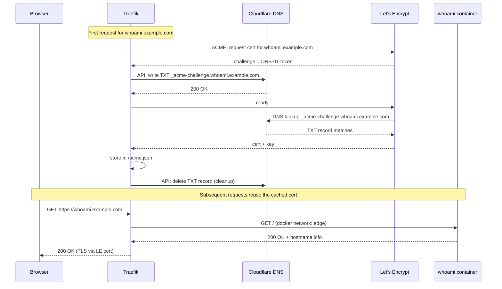

# traefik-example — Traefik + whoami + Cloudflare DNS-01

A minimal Docker Compose stack that demonstrates the HTTPS pattern the rest
of this example assumes: Traefik as the edge proxy, Let's Encrypt certs
issued via **Cloudflare DNS-01** (no inbound :80 needed), and a `whoami`
backend to prove end-to-end routing.

Drop this onto the VM that `vm-example.tf` creates and it will serve
`https://whoami.example.com` with a valid LE cert.

## Why DNS-01 (and not HTTP-01)?

- You don't need to expose port 80 to the internet. Great for LAN-only
  services you still want certs for.
- Works for wildcard certs, so you can issue `*.example.com` once and reuse.
- Needs an API token scoped to `Zone:DNS:Edit` on the target zone.



## Prerequisites

- A Cloudflare-managed zone for the domain you'll use (replace `example.com`
  throughout `docker-compose.yml`).
- A Cloudflare API token with **Zone:DNS:Edit** on that zone.
  Create at <https://dash.cloudflare.com/profile/api-tokens>.
- Docker + Docker Compose on the target host (the Ansible playbook in
  `../../ansible/` installs Docker for you on `docker_hosts`).

## Setup

```bash
# 1. Create the acme.json Traefik writes certs to (must be 0600 or Traefik refuses to start)
touch acme.json && chmod 600 acme.json

# 2. Drop your Cloudflare token into .env
cp .env.example .env
$EDITOR .env

# 3. Bring it up
docker compose up -d

# 4. Watch Traefik get the cert (first request triggers issuance)
docker compose logs -f traefik
```

Within ~30 seconds of the first request to `https://whoami.example.com`,
you should see Traefik log `Register... obtain` and then hand back a
valid Let's Encrypt cert.

## Adding more services

Any container on the `edge` network with the right labels gets routed
automatically:

```yaml
services:
  grafana:
    image: grafana/grafana
    networks: [edge]
    labels:
      - traefik.enable=true
      - traefik.http.routers.grafana.rule=Host(`grafana.example.com`)
      - traefik.http.routers.grafana.entrypoints=websecure
      - traefik.http.routers.grafana.tls.certresolver=cloudflare
      - traefik.http.services.grafana.loadbalancer.server.port=3000
```

Make sure the DNS name (`grafana.example.com`) resolves to the VM's IP —
a wildcard `*.example.com` CNAME record pointing at the VM is the easiest
way.

## Things deliberately left out

- **HTTP basic-auth password** for the dashboard is a placeholder. Generate
  a real one with `htpasswd -nB admin`.
- **No automatic container restarts** on Traefik config changes — if you
  modify the compose file, `docker compose up -d` to reconcile.
- **No middleware chains** (rate limits, IP allow-lists, forward auth).
  Keep the example readable; add those per your environment.
