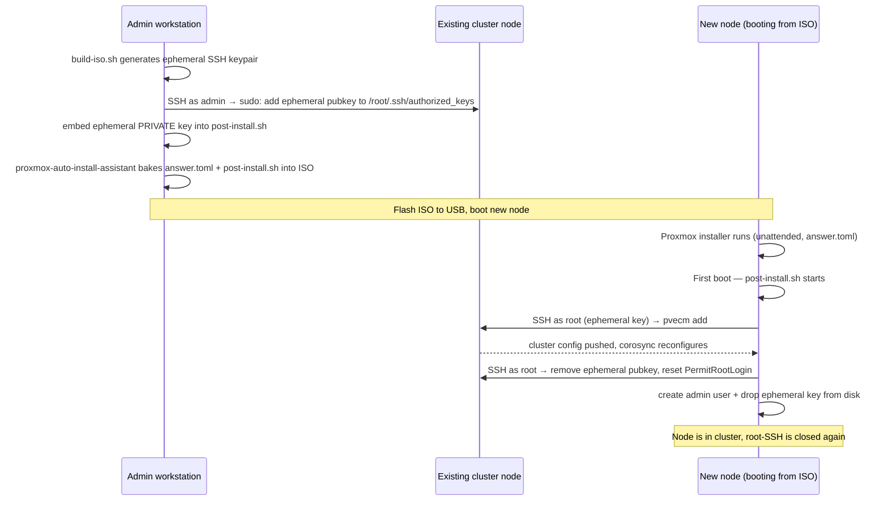

# proxmox-iso — Headless Proxmox installer + cluster join

Build an unattended Proxmox VE install ISO that:

1. Installs Proxmox with your answer file (keyboard, disks, root password, SSH keys)
2. Registers itself in DNS on first boot (optional, via TSIG)
3. **Joins an existing Proxmox cluster automatically** — no keyboard, no web UI
4. Bootstraps an `admin` user so Ansible can connect as a non-root user
5. Cleans up after itself (deletes the one-time SSH key it used to join)

Flash, boot, walk away. ~5–10 minutes later the node is in your cluster and
ready for `ansible-playbook playbooks/proxmox.yml --limit <node>`.

## How cluster join works

The tricky bit is letting the new node SSH as `root` into an existing cluster
node long enough to run `pvecm add`, without permanently enabling root-by-password
anywhere. The flow uses a one-time SSH key that exists only for the length of
the install:



## Files

| File | Purpose |
|---|---|
| `build-iso.sh` | Driver. Reads `answer-<node>.toml`, discovers the cluster from the sibling `ansible/inventory.yml`, generates the ephemeral key, pushes it, builds the ISO on a reachable cluster node, downloads it. |
| `post-install.sh` | Runs on the new node at first boot. Contains `__PLACEHOLDER__` tokens that `build-iso.sh` substitutes. Joins the cluster, registers DNS, bootstraps `admin`, cleans up. |
| `answer.example.toml` | Answer-file template. Copy to `answer-<node>.toml` per node and edit FQDN, disks, SSH keys. |
| `flash-iso.sh` | Helper to dd the finished ISO to a USB stick (macOS + Linux). |

## Prerequisites

- An existing Proxmox cluster of at least one node (for single-node "clusters"
  you don't need this workflow — just run the installer by hand once).
- `ssh`, `ssh-keygen`, `ansible`, `python3`, `wget`, `pv` on your workstation.
- SSH access to the existing cluster node(s) as a user with `sudo` (the script
  uses `BUILD_SSH_USER`, default `admin`).
- A public key at `../ansible/ssh-keys/admin.pub` — dropped into the new node
  so you can SSH to it after install.
- The sibling `../ansible/` directory configured (the script reads
  `inventory.yml` + `vault.pwd` from there).

## Quick start

```bash
# 1. One answer file per node
cp answer.example.toml answer-pve2.toml
$EDITOR answer-pve2.toml     # set fqdn, disks, root ssh key

# 2. Build + download the ISO (prompts for root password, discovers cluster)
./build-iso.sh pve2 auto

# 3. Flash to USB
sudo ./flash-iso.sh proxmox-pve2-autoinstall.iso /dev/sdX

# 4. Boot the new node from USB. Walk away. ~5–10 min later:
ansible-playbook ../ansible/playbooks/proxmox.yml --limit pve2
```

`./build-iso.sh <node> auto` lets the remote build host pick the latest
Proxmox VE ISO from `http://download.proxmox.com/iso/`. Pass a local path
instead (`./build-iso.sh pve2 /tmp/proxmox-ve_9.0-2.iso`) to pin a version.

## Environment overrides

| Variable | Default | Purpose |
|---|---|---|
| `BUILD_SSH_USER` | `admin` | Non-root user on cluster nodes that can `sudo bash`. |
| `DNS_ZONE` | `example.lan` | DNS zone to register the node in (skipped if no TSIG key). |
| `DNS_SERVER` | `192.168.1.1` | Your BIND9/authoritative DNS server IP. |
| `PVE_ROOT_PASSWORD` | *(prompt)* | Skip the interactive prompt. |

DNS registration uses `nsupdate` + a TSIG key read from the sibling Ansible
vault (`vault_bind_update_tsig_secret`). If the vault doesn't have that key,
DNS registration is skipped silently — the rest of the flow still works.

## Why not just use the Proxmox web UI?

Because this works with 5 nodes the same way it works with 1, and because
every step is reproducible from source control. The manual "pvecm add" flow
needs an operator at the console of the new node; this one hands you a
USB stick and some coffee time.
